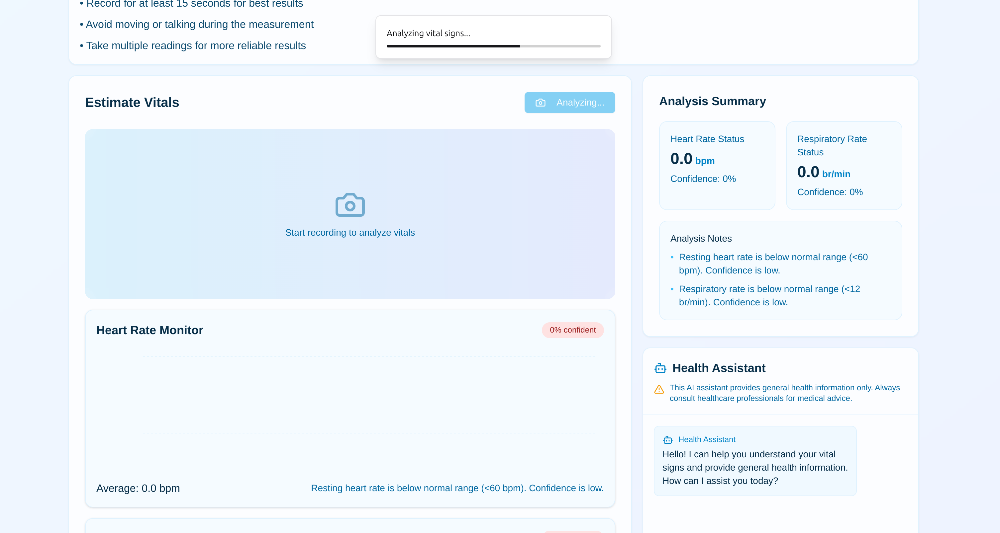
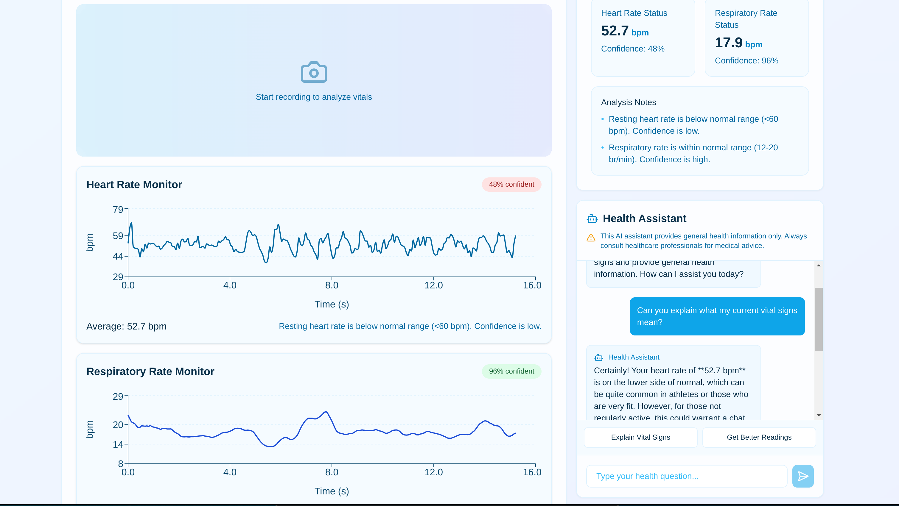

# HealthPulse

[Website Link](https://health-pulse-seven.vercel.app/)

HealthPulse is a web-based platform that demonstrates the integration of computer vision and AI in healthcare technology. The application provides contactless vital sign monitoring through webcam-based photoplethysmography (PPG) and features an AI health assistant for personalized guidance.




## Features

### Real-time Vital Sign Monitoring
- Heart rate measurement through PPG technology
- Respiratory rate detection
- Real-time confidence scores
- Visual data representation with interactive charts

### AI Health Assistant
- Personalized health information
- Natural language interaction
- General health guidance
- Vital sign interpretation

### Technical Features
- Contactless monitoring using computer vision
- Real-time video processing at 30 FPS
- Quick analysis and results
- Responsive web design

## Technology Stack

### Frontend
- Next.js 15 (App Router)
- React
- TypeScript
- TailwindCSS
- shadcn/ui components
- Recharts for data visualization

### Backend
 - Next.js/Node 
 - AWS API Gateway (api endpoint management)
 - AWS Lambda (serverless functions)
 - AWS S3 (temp video storage)
 - AWS DynamoDB (temp conversation history)
 - FastAPI (only during initial api testing)
 - Vercel (managed deployment)

### APIs & Integrations
- VitalLens API from Roust Labs for vital sign detection
- OpenAI/xAI API using grok-beta model for health assistant chatbot
- Built-in Web Browser APIs for camera access and video capture

## Getting Started

### Prerequisites
- Node.js 18.17 or later
- A modern web browser with webcam access
- VitalLens API key from [Roust Labs](https://www.rouast.com/api/)

### Installation

1. Clone the repository
```bash
git clone https://github.com/yourusername/healthpulse.git
cd healthpulse
```

2. Install dependencies
```bash
npm install
```

3. Set up environment variables
```bash
# Create a .env file
cp .env.example .env

# Add your API key
VITALLENS_API_KEY=your_api_key_here
```

4. Set up AWS cloud architecture (api gateway, lambdas, bucket, dynamodb)

5. Run the development server
```bash
npm run dev
```

5. Open [http://localhost:3000](http://localhost:3000) in your browser

## Project Structure

```
src/
├── app/
│   ├── page.tsx                # Home page
│   ├── about/
│   │   └── page.tsx            # About page
│   ├── help/
│   │   └── page.tsx            # Help page
│   └── dashboard/
│       └── page.tsx            # Main dashboard
├── components/
│   ├── ui/
│   │   └── Navigation.tsx      # Site navigation
│   ├── home/
│   │   ├── Hero.tsx
│   │   ├── Features.tsx
│   │   ├── TechnicalDetails.tsx
│   │   └── Disclaimer.tsx
│   ├── dashboard/
│   │   ├── DashboardClient.tsx
│   │   ├── MainAnalysisPanel.tsx
│   │   ├── ControlBar.tsx
│   │   └── AnalysisSummary.tsx
│   └── vitals/
│       ├── VitalsChart.tsx
│       ├── VitalMetricCard.tsx
│       └── RecordingProgress.tsx
├── config/
│   └── awsConfig.ts            # AWS configuration
├── hooks/
│   ├── useVitalsMonitor.ts     # Vital signs monitoring logic
│   └── useCamera.ts            # Camera handling logic
└── types/
    └── index.ts                # TypeScript types
```
```

## Key Features Implementation

### Vital Signs Monitoring
The application uses the VitalLens API to process video streams and extract vital signs using photoplethysmography (PPG). This allows for contactless measurement of:
- Heart rate through blood flow detection
- Respiratory rate through chest movement analysis

### Camera Handling
- Uses MediaRecorder API for video capture
- Supports both MP4 and WebM formats
- Automatic quality and codec selection

### Real-time Analysis
- Processes video at 30 FPS
- Provides immediate vital sign measurements
- Includes confidence scores for accuracy
- Displays real-time data visualization

## Development Notes

### Browser Support
- Chrome/Edge (Recommended)
- Firefox
- Safari

### Known Limitations
- Vitallens free tier limits to 100 monthly requests (assuming ~30s requests)
- Requires good lighting conditions
- Subject must remain relatively still
- Performance depends on camera quality
- Best results with at least 15-second recordings

### Future Work
- Currently recording/saving video before passing to API, but I want to try a streaming implementation to actually monitor vitals in real-time as we're recording. Just not sure if it would eat through my free tier requests.

## Acknowledgments

This project utilizes the VitalLens API from Roust Labs for vital signs detection. VitalLens provides the computer vision and PPG technology that enables contactless vital sign monitoring. They also built the python client that abstracts api implementation, face detection and video/frame optimization (cropping, zooming, etc.)

## Disclaimer

This is a learning project created to explore healthcare technology implementation. It should not be used for medical diagnosis or treatment decisions. Always consult healthcare professionals for medical advice and use FDA-approved devices for clinical vital sign monitoring.